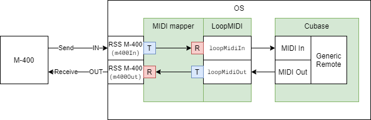

# Midi mapper

This application is a tool for mapping the System Exclusive [MIDI messages](https://en.wikipedia.org/wiki/MIDI#Messages) of a [mixing console](https://en.wikipedia.org/wiki/Digital_mixing_console), particularly a [Roland M-400](https://proav.roland.com/global/products/m-400/) to Control Change messages that can be used by a [DAW](https://en.wikipedia.org/wiki/Digital_audio_workstation), particularly [Cubase](https://new.steinberg.net/cubase/) with [Fabfilter](https://www.fabfilter.com/) effects.

In the middle, it uses a bunch of [LoopMidi](https://www.tobias-erichsen.de/software/loopmidi.html) virtual MIDI devices to make life easier.

## The concept

The idea was to have a physical device controlling the data in the DAW in a live mixing scenario. There are devices specifically designed for this purpose (like the [X-TOUCH](https://www.behringer.com/product.html?modelCode=P0B1X)), but they are rather expensive, and we already had a mixer that we did not use at the time. So we decided to give this concept a try.

The dataflow would be two-way: we can control the various parameters in the DAW with the console, and the changes we make in the DAW will propagate to the console as well. This way the two parts of the system is always in sync, and in both ends, we always see the true values (or almost true, as I will explain later).

### Mapping between SysEx and CC

One part of the problem is to transform the messages from the console's SysEx messages to CC messages, and then back from CC to SysEx. This was pretty straightforward, it just involved a lot of [documentation](https://static.roland.com/assets/media/pdf/m400_m380_MIDI_e03.pdf) reading, and organizing the code meaningfully and maintainably.

### Mapping values

The other and definitely more challenging part is to define a map that maps the values from each control of the console to the appropriate control of the DAW, and also the other way around.

The M-400 has a predefined set of values for each control. For example, the equalizer frequencies can have 121 distinct values: 20, 21, 22, 24, 25, 27, ..., 18.0k, 19.0k, 20.0k (Hz) (see the table below). These scales are designed to roughly conform with a meaningful scale (logarithmic in this example) but also to have more or less rounded values that are easily readable and memorable.

The scales in the DAW are much different. In the case of equalizer frequency (in Fabfilter Pro-Q 2), the values span from 10 Hz to 30 kHz. When we assign a MIDI CC to a control in the DAW, whenever a message arrives (it will have a value between 0 and 127), a certain value will be set on the control. In this example, the value 0 will set the frequency to 10.000 Hz, 1 will set it to 10.651 Hz, 2 to 11.344 Hz, etc. all the way up to 127 to 30000 Hz.

Unfortunately, we have no control over the way the MIDI CC message maps to the control value. The best we can do is to find the closest value on the scale of the console, and map that value to the corresponding CC value. This comes with some suboptimal value mappings, but the difference is subtle. For example, the CC value 22 maps to 40.024 Hz, which is close to 40 Hz, but 25 maps to 48.356 Hz, which is halfway between 47 and 50 Hz. See the table below for the complete mapping of frequency.

    
Frequency mapping table (click to open/close)

|M-400|CC  |Pro-Q 2|
|----:|---:|------:|
|20|0|10.000|
|20|1|10.651|
|20|2|11.344|
|20|3|12.082|
|20|4|12.868|
|20|5|13.705|
|20|6|14.597|
|20|7|15.547|
|20|8|16.559|
|20|9|17.636|
|20|10|18.784|
|20|11|20.006|
|21|12|21.308|
|22|13|22.694|
|24|14|24.171|
|25|15|25.744|
|27|16|27.419|
|28|16|27.419|
|30|17|29.203|
|32|18|31.103|
|33|19|33.127|
|36|20|35.283|
|38|21|37.579|
|40|22|40.024|
|42|23|42.628|
|45|24|45.402|
|47|25|48.356|
|50|26|51.503|
|53|27|54.854|
|56|27|54.854|
|60|28|58.423|
|63|29|62.225|
|67|30|66.274|
|71|31|70.586|
|75|32|75.179|
|80|33|80.071|
|84|34|85.281|
|90|35|90.831|
|94|36|96.741|
|100|37|103.04|
|106|37|103.04|
|112|38|109.74|
|120|39|116.88|
|125|40|124.49|
|133|41|132.59|
|140|42|141.21|
|150|43|150.4|
|160|44|160.19|
|170|45|170.61|
|180|46|181.72|
|190|47|193.54|
|200|48|206.13|
|210|48|206.13|
|224|49|219.55|
|237|50|233.83|
|250|51|249.05|
|266|52|265.25|
|280|53|282.51|
|300|54|300.9|
|315|55|320.47|
|335|56|341.33|
|355|57|363.54|
|376|58|387.19|
|400|58|387.19|
|422|59|412.39|
|450|60|439.22|
|473|61|467.8|
|500|62|498.24|
|530|63|530.66|
|560|64|565.19|
|600|65|601.97|
|630|66|641.14|
|670|67|682.86|
|710|68|727.29|
|750|69|774.62|
|800|69|774.62|
|840|70|825.02|
|900|71|878.7|
|944|72|935.88|
|1000|73|996.78|
|1060|74|1061.6|
|1120|75|1130.7|
|1200|76|1204.3|
|1250|77|1282.7|
|1330|78|1366.7|
|1400|79|1455|
|1500|79|1455|
|1600|80|1549.7|
|1700|81|1650.5|
|1800|82|1757.9|
|1900|83|1872.3|
|2000|84|1994.2|
|2100|85|2123.9|
|2240|86|2262.1|
|2370|87|2409.3|
|2500|88|2566.1|
|2660|89|2733.1|
|2800|90|2910.9|
|3000|90|2910.9|
|3150|91|3100.3|
|3350|92|3302|
|3550|93|3516.9|
|3760|94|3745.7|
|4000|95|3989.5|
|4220|96|4249.1|
|4500|97|4525.6|
|4730|98|4820|
|5000|99|5133.7|
|5300|100|5467.7|
|5600|100|5467.7|
|6000|101|5823.5|
|6300|102|6202.4|
|6700|103|6606|
|7100|104|7035.9|
|7500|105|7493.7|
|8000|106|7981.3|
|8400|107|8500.7|
|9000|108|9053.8|
|9440|109|9642.9|
|10000|110|10270|
|10600|111|10939|
|11200|111|10939|
|12000|112|11650|
|12500|113|12409|
|13300|114|13216|
|14000|115|14076|
|15000|116|14992|
|16000|117|15967|
|17000|118|17006|
|18000|119|18113|
|19000|120|19292|
|20000|121|20547|
|20000|122|21884|
|20000|123|23308|
|20000|124|24825|
|20000|125|26440|
|20000|126|28160|
|20000|127|30000|

## The layout of the parameters in the virtual MIDI devices

An important part of the implementation was to decide for each individual parameter where to map them on the virtual devices, specifically, to which CC of which channel of which device. This layout is arbitrary, it does not affect the behavior in any way, it just helps to better overview the parameters.

There are 16 channels a MIDI device can use. In each channel, there are 128 Control Changes. This means that a device can handle 2048 distinct parameters. This amount is just enough for a basic set of parameters for the amount of mixer channels we desire to use. However, if all the parameters were tightly packed, it would not be well-structured, could not be understood by a glance, and it would be hardly maintainable, in other words, it would be a programmatic nightmare.

So after a short contemplation, I decided to make each mixer channel correspond to a single MIDI channel. This way, we would need a couple more virtual MIDI devices, but each channel would have plenty of room for all the parameters we need and even more if we decide that we need to implement more in the future. It is easier from a programmatic standpoint too, because each kind of parameter can have the same CC number throughout all the channels, for example the gain of the first band of the equalizer can be the CC 10 on every channel.

### Organizing the channels

Okay, so we would like to be able to control the parameters of 48 input channels, 16 auxiliary output, a main output channel, maybe 8 [DCAs](https://www.sweetwater.com/sweetcare/articles/behringer-x32-what-is-a-dca-and-when-should-i-use-one/) and some more channels in the future (e.g. talkback). So how would we organize these channels into MIDI devices of 16 channels? Fortunately, it is pretty intuitive (these all have the loopMidi prefix to be easily identifiable in the code):

- `loopMidiInCh1_16`
- `loopMidiInCh17_32`
- `loopMidiInCh33_48`
- `loopMidiInAux`
- `loopMidiInMain`

The first four are full already, the `loopMidiInMain` has 15 remaining channels that can be used for DCAs and other purposes.

### Organizing the parameters

In the table below, you can see the complete mapping of the parameters to CCs. Certain kinds of parameters only applies to certain groups of channels For example, the effect sends are only for the input channels. This is what the checkmarks indicate.

|Parameter|CC|Input|Aux|Main|DCA
|---|---|---|---|---|---|
|Mute|0|✓|✓|✓|✓|
|Level|1|✓|✓|✓|✓|
|Pan|2|✓|✓|✓||

## Java MIDI package

The program uses the `javax.sound.midi` package. The most important classes/interfaces in this application are `MidiDevice`, `Receiver`, `Transmitter`, `MidiMessage`, `ShortMessage` and `SysexMessage`.

A `MidiDevice` is what the OS sees when you plug in a physical device. We can get an array of the currently available MIDI devices in the system with the `MidiSystem.getMidiDeviceInfo()` function. Usually, each device has two instances, for an IN and an OUT port. An IN port is the one that sends data from the device to the OS, and it is represented as a MidiDevice that can have a `Transmitter`. On the other hand, an OUT port is the one that sends data from the OS back to the device. This one can have a `Receiver`.

The messages coming from transmitters can be captured by custom receivers that implement the `Receiver` interface. In order to do this, first, we need to pass our receiver to the transmitter's `setReceiver()` function as parameter. Second, in our receiver implementation, the `send(MidiMessage message, long timeStamp)` overridden method should handle the transmitter's messages.

To send a message from the program to a receiver, we can simply call its send method, and pass a subclass of `MidiMessage`, particularly `ShortMessage` for Control Change, and `SysexMessage` for SysEx messages.

## Block diagram of the whole system
